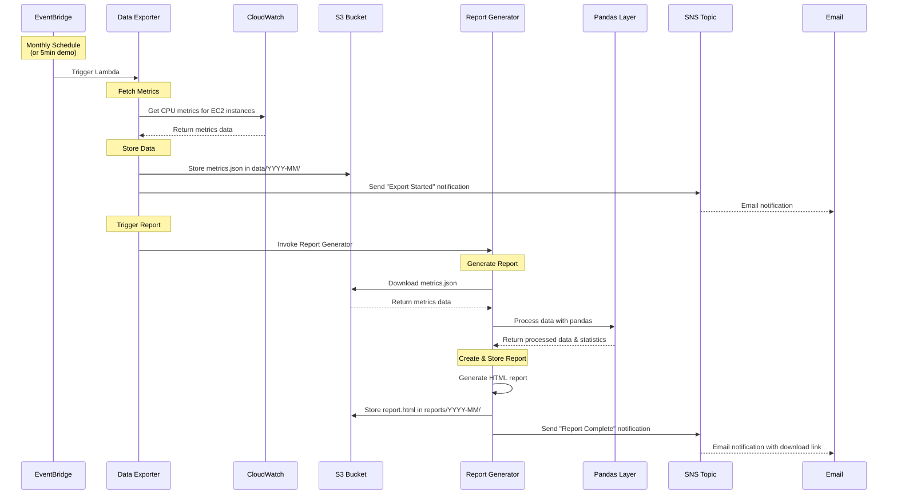

# CloudWatch S3 Reporting System

A serverless solution that automatically exports CloudWatch metrics to S3 and generates HTML reports using AWS SAM, pandas, and AWS managed layers.

## Overview

This system consists of:
- **Data Exporter Lambda**: Fetches CloudWatch CPU metrics and stores them in S3
- **Report Generator Lambda**: Creates HTML reports with pandas data analysis
- **EventBridge Rule**: Triggers the process monthly (or every 5 minutes in demo mode)
- **SNS Topic**: Sends notifications about process status
- **AWS Managed Layers**: Uses AWS's pandas and powertools layers for dependencies

## Architecture


### Key Components

- **SAM Template**: Serverless Application Model for easy deployment
- **AWS Managed Layers**: No custom dependency management needed
- **HTML Reports**: Professional reports with tables, statistics, and styling
- **Current Month Data**: Fetches data from the current month instead of previous month

## Prerequisites

- [AWS SAM CLI](https://docs.aws.amazon.com/serverless-application-model/latest/developerguide/install-sam-cli.html) installed
- AWS CLI configured with appropriate permissions
- Python 3.11+ installed

## Quick Start

### 1. Configure Deployment Settings

Copy the example configuration file and customize it:

```bash
cp samconfig.toml.example samconfig.toml
```

Edit `samconfig.toml` and update these values:
- **stack_name**: Your CloudFormation stack name
- **BucketName**: S3 bucket name (must be globally unique)  
- **NotificationEmail**: Your email for notifications
- **ScheduleMode**: `demo` (every 5 minutes) or `production` (monthly)
- **region**: Your preferred AWS region

### 2. Deploy with SAM (Recommended)

```bash
# Validate and deploy
sam validate
sam build
sam deploy
```

**For first-time setup, use guided deployment:**
```bash
sam deploy --guided
```

**Or use the automated deployment script:**
```bash
python deploy.py
```

### 3. Confirm SNS Subscription

Check your email and confirm the SNS subscription to receive notifications.

## Configuration Parameters

| Parameter | Description | Example Value |
|-----------|-------------|---------------|
| `BucketName` | S3 bucket name for storing data and reports | `my-cloudwatch-reports` |
| `NotificationEmail` | Email address for notifications | `admin@example.com` |
| `ScheduleMode` | Schedule frequency | `demo` or `production` |

## Testing the System

### Manual Testing

Use the provided test events to verify functionality:

```bash
# Test Data Exporter (triggers complete pipeline)
aws lambda invoke \
  --function-name YourStackName-DataExporter \
  --payload file://test-data-exporter-event.json \
  response.json

# Test Report Generator separately (if needed)
aws lambda invoke \
  --function-name YourStackName-ReportGenerator \
  --payload file://test-report-generator-event.json \
  report-response.json
```

### Check Results

1. **S3 Data**: `s3://your-bucket/data/YYYY-MM/metrics.json`
2. **S3 Report**: `s3://your-bucket/reports/YYYY-MM-report.html`
3. **Notifications**: Check your email for status updates
4. **Logs**: Check CloudWatch Logs for both Lambda functions

## File Structure

```
├── template.yaml                    # SAM template
├── samconfig.toml                   # SAM configuration
├── deploy.py                        # Automated deployment script
├── lambda/
│   ├── data_exporter/
│   │   └── lambda_function.py
│   └── report_generator/
│       └── lambda_function.py
├── events/                          # Test events
│   ├── test-data-exporter-event.json
│   └── test-report-generator-event.json
└── README.md
```

## How It Works



### Process Flow

1. **EventBridge Rule** triggers the Data Exporter Lambda (monthly or every 5 minutes in demo)
2. **Data Exporter** fetches CloudWatch CPU metrics for configured EC2 instances
3. **Data Exporter** stores metrics data in S3 as JSON
4. **Data Exporter** invokes the Report Generator Lambda
5. **Report Generator** downloads the metrics data from S3
6. **Report Generator** processes data using pandas (from AWS layer)
7. **Report Generator** generates professional HTML report with statistics
8. **Report Generator** uploads the HTML report to S3 and sends notification

## AWS Managed Layers Used

- **AWSSDKPandas-Python311**: Provides pandas, numpy, and data processing libraries
- **AWSLambdaPowertoolsPythonV2**: Provides structured logging and utilities

## Instance Configuration

The system uses real EC2 instance IDs from your account. To modify which instances are monitored, update the `get_sample_instances()` function in `lambda/data_exporter/lambda_function.py`:

```python
def get_sample_instances():
    # Current: Hardcoded instance IDs
    sample_instances = [
        'i-03b933276fbf10181',
        'i-0586fae46f1e7e9ea',
        'i-038d58c996d553eaa'
    ]
    
    # Alternative: Query instances by tags
    # response = ec2.describe_instances(
    #     Filters=[
    #         {'Name': 'tag:Environment', 'Values': ['production']},
    #         {'Name': 'instance-state-name', 'Values': ['running']}
    #     ]
    # )
    
    return sample_instances
```

## Report Features

The HTML reports include:
- **Executive Summary**: Overall CPU statistics across all instances
- **Instance Summary Table**: Per-instance statistics with pandas analysis
- **Daily Details**: Day-by-day CPU utilization data
- **Recommendations**: Automated suggestions based on usage patterns
- **Professional Styling**: Clean, responsive HTML with CSS

### Debugging Commands

```bash
# View SAM logs
sam logs -n DataExporterFunction --tail
sam logs -n ReportGeneratorFunction --tail

# Check S3 contents
aws s3 ls s3://your-bucket-name --recursive

# Test locally (if SAM local is set up)
sam local invoke ReportGeneratorFunction -e events/test-report-generator-event.json
```

## Performance & Cost

- **Lambda Memory**: Data Exporter: 512 MB, Report Generator: 1024 MB
- **Lambda Timeout**: Data Exporter: 5 minutes, Report Generator: 3 minutes
- **S3 Storage**: Reports ~50KB, data files ~5KB per month
- **Estimated Cost**: < $2/month for typical usage with demo mode

## Customization

### Adding More Metrics

Modify `fetch_cloudwatch_metrics()` in the Data Exporter:

```python
# Add memory utilization
memory_response = cloudwatch.get_metric_statistics(
    Namespace='CWAgent',
    MetricName='mem_used_percent',
    # ... other parameters
)
```

### Changing Schedule

Update the SAM template `Events` section:

```yaml
Events:
  MonthlySchedule:
    Type: Schedule
    Properties:
      Schedule: 'cron(0 9 1 * ? *)'  # First day of month at 9 AM
```

### Report Customization

The Report Generator uses pandas for data processing and HTML generation. Modify the `create_html_report()` function to:
- Add more charts and visualizations
- Change styling and layout
- Include additional metrics or analysis

## Security

- IAM roles follow least-privilege principles
- S3 bucket encryption enabled by default
- No public access to resources
- AWS managed layers provide security-vetted dependencies
