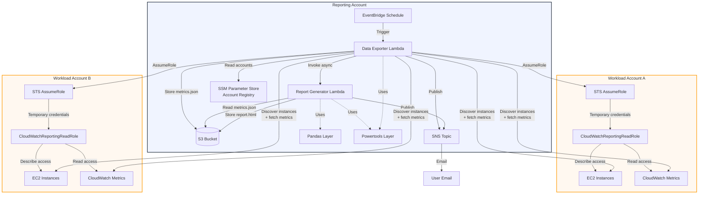
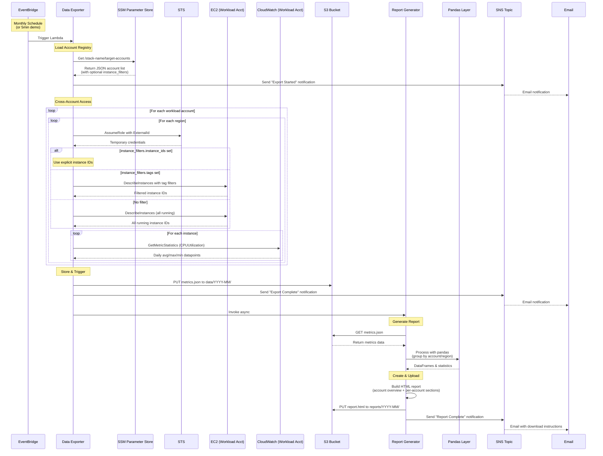

# CloudWatch S3 Reporting System

A serverless solution that automatically exports CloudWatch metrics from multiple AWS accounts to S3 and generates HTML reports using AWS SAM, pandas, and AWS managed layers. Supports a hub-and-spoke model with a central reporting account pulling data from workload accounts via cross-account IAM roles.

## Overview

This system consists of:
- **Data Exporter Lambda**: Fetches CloudWatch CPU metrics from multiple AWS accounts via cross-account IAM roles and stores them in S3
- **Report Generator Lambda**: Creates HTML reports with pandas data analysis, grouped by account
- **EventBridge Rule**: Triggers the process monthly (or every 5 minutes in demo mode)
- **SNS Topic**: Sends notifications about process status
- **SSM Parameter Store**: Account registry for managing target workload accounts without redeployment
- **Cross-Account IAM Roles**: Deployed to workload accounts via StackSets for secure metric access
- **AWS Managed Layers**: Uses AWS's pandas and powertools layers for dependencies

## Architecture


### Key Components

- **SAM Template**: Serverless Application Model for easy deployment
- **Cross-Account IAM Roles**: Secure read-only access to workload accounts via STS AssumeRole
- **SSM Parameter Store**: Dynamic account registry — add/remove accounts without redeploying
- **AWS Managed Layers**: No custom dependency management needed
- **HTML Reports**: Professional reports with per-account sections, tables, statistics, and styling
- **Current Month Data**: Fetches data from the current month instead of previous month

## Prerequisites

- [AWS SAM CLI](https://docs.aws.amazon.com/serverless-application-model/latest/developerguide/install-sam-cli.html) installed
- AWS CLI configured with appropriate permissions
- Python 3.11+ installed

## Quick Start

### 1. Configure Deployment Settings

Copy the example configuration file and customize it:

```bash
cp samconfig.toml.example samconfig.toml
```

Edit `samconfig.toml` and update these values:
- **stack_name**: Your CloudFormation stack name
- **BucketName**: S3 bucket name (must be globally unique)  
- **NotificationEmail**: Your email for notifications
- **ScheduleMode**: `demo` (every 5 minutes) or `production` (monthly)
- **region**: Your preferred AWS region

### 2. Deploy with SAM (Recommended)

```bash
# Validate and deploy
sam validate
sam build
sam deploy
```

**For first-time setup, use guided deployment:**
```bash
sam deploy --guided
```

**Or use the automated deployment script:**
```bash
python deploy.py
```

### 3. Confirm SNS Subscription

Check your email and confirm the SNS subscription to receive notifications.

## Configuration Parameters

| Parameter | Description | Example Value |
|-----------|-------------|---------------|
| `BucketName` | S3 bucket name for storing data and reports | `my-cloudwatch-reports` |
| `NotificationEmail` | Email address for notifications | `[email]` |
| `ScheduleMode` | Schedule frequency | `demo` or `production` |
| `CrossAccountRoleName` | IAM role name in workload accounts | `CloudWatchReportingReadRole` |
| `CrossAccountExternalId` | External ID for STS assume role security | `CloudWatchReporting2026` |

## Testing the System

### Manual Testing

Use the provided test events to verify functionality:

```bash
# Test Data Exporter (triggers complete pipeline)
aws lambda invoke \
  --function-name YourStackName-DataExporter \
  --payload file://events/test-data-exporter.json \
  response.json

# Test Report Generator separately (if needed)
aws lambda invoke \
  --function-name YourStackName-ReportGenerator \
  --payload file://events/test-report-generator.json \
  report-response.json
```

### Testing with Sample Multi-Account Data

A sample metrics file is provided at `events/sample-metrics.json` with realistic multi-account data (2 accounts, 2 regions, 4 instances). Upload it to S3 to test the report generator without needing live cross-account access:

```bash
# Upload sample data to S3
aws s3 cp events/sample-metrics.json \
  s3://your-bucket/data/2026-03/metrics.json

# Invoke the report generator
aws lambda invoke \
  --function-name YourStackName-ReportGenerator \
  --payload file://events/test-report-generator.json \
  report-response.json
```

Or test locally with SAM:

```bash
sam local invoke ReportGeneratorFunction -e events/test-report-generator.json
```

### Check Results

1. **S3 Data**: `s3://your-bucket/data/YYYY-MM/metrics.json`
2. **S3 Report**: `s3://your-bucket/reports/YYYY-MM-report.html`
3. **Notifications**: Check your email for status updates
4. **Logs**: Check CloudWatch Logs for both Lambda functions

## Cross-Account Setup

This system supports a hub-and-spoke model where the SAM stack runs in a central reporting account and pulls CloudWatch metrics from multiple workload accounts. Each workload account needs an IAM role that trusts the reporting account.

The role template is located at `cross-account/workload-account-role.yaml`.

### Single Account Deployment

To deploy the role into one workload account manually:

```bash
aws cloudformation deploy \
  --template-file cross-account/workload-account-role.yaml \
  --stack-name cloudwatch-reporting-role \
  --parameter-overrides ReportingAccountId=<YOUR_REPORTING_ACCOUNT_ID> \
  --capabilities CAPABILITY_NAMED_IAM \
  --profile <workload-account-profile>
```

### Multi-Account Deployment with StackSets (AWS Organizations)

If your accounts are in an AWS Organization, StackSets is the easiest way to roll the role out across all workload accounts at once. Run these commands from the management account (or a delegated administrator account).

#### 1. Create the StackSet

```bash
aws cloudformation create-stack-set \
  --stack-set-name CloudWatchReportingRole \
  --template-body file://cross-account/workload-account-role.yaml \
  --parameters ParameterKey=ReportingAccountId,ParameterValue=<YOUR_REPORTING_ACCOUNT_ID> \
  --capabilities CAPABILITY_NAMED_IAM \
  --permission-model SERVICE_MANAGED \
  --auto-deployment Enabled=true,RetainStacksOnAccountRemoval=false
```

- `SERVICE_MANAGED` lets Organizations handle trust automatically — no extra admin roles needed.
- `auto-deployment Enabled=true` means any new account added to the target OU gets the role automatically.

#### 2. Deploy to Organizational Units

```bash
aws cloudformation create-stack-instances \
  --stack-set-name CloudWatchReportingRole \
  --deployment-targets OrganizationalUnitIds=ou-xxxx-yyyyyyyy \
  --regions us-east-1 \
  --operation-preferences MaxConcurrentPercentage=25,FailureTolerancePercentage=10
```

Replace `ou-xxxx-yyyyyyyy` with the OU ID(s) containing your workload accounts. Since IAM is global, deploying to a single region (e.g., `us-east-1`) is sufficient.

#### 3. Verify Deployment

```bash
# List all stack instances and their status
aws cloudformation list-stack-instances \
  --stack-set-name CloudWatchReportingRole

# Check a specific deployment operation
aws cloudformation describe-stack-set-operation \
  --stack-set-name CloudWatchReportingRole \
  --operation-id <operation-id>
```

#### 4. Add Accounts Later

With `auto-deployment` enabled, new accounts added to the target OU get the role automatically. To add accounts in a different OU:

```bash
aws cloudformation create-stack-instances \
  --stack-set-name CloudWatchReportingRole \
  --deployment-targets OrganizationalUnitIds=ou-xxxx-zzzzzzzz \
  --regions us-east-1
```

### Multi-Account Deployment without Organizations (Self-Managed)

If your accounts are not in an Organization, you can use self-managed StackSets. This requires two prerequisite roles:

- `AWSCloudFormationStackSetAdministrationRole` in the reporting/management account
- `AWSCloudFormationStackSetExecutionRole` in each target workload account

See [AWS docs on self-managed StackSet permissions](https://docs.aws.amazon.com/AWSCloudFormation/latest/UserGuide/stacksets-prereqs-self-managed.html) for setup details.

```bash
# Create the StackSet
aws cloudformation create-stack-set \
  --stack-set-name CloudWatchReportingRole \
  --template-body file://cross-account/workload-account-role.yaml \
  --parameters ParameterKey=ReportingAccountId,ParameterValue=<YOUR_REPORTING_ACCOUNT_ID> \
  --capabilities CAPABILITY_NAMED_IAM \
  --permission-model SELF_MANAGED

# Deploy to specific account IDs
aws cloudformation create-stack-instances \
  --stack-set-name CloudWatchReportingRole \
  --accounts 444455556666 777788889999 \
  --regions us-east-1 \
  --operation-preferences MaxConcurrentCount=2,FailureToleranceCount=0
```

## Managing the Account Registry (SSM Parameter Store)

Once the SAM stack is deployed, an SSM Parameter is created at `/<stack-name>/target-accounts` to serve as the account registry. The Data Exporter Lambda reads this parameter on every invocation, so you can add or remove workload accounts without redeploying.

### Parameter Format

The parameter value is a JSON array of account objects:

```json
[
  {
    "account_id": "111122223333",
    "regions": ["us-east-1"],
    "alias": "prod-workloads"
  },
  {
    "account_id": "444455556666",
    "regions": ["us-east-1", "us-west-2"],
    "alias": "staging",
    "instance_filters": {
      "instance_ids": ["i-0abc123def456789", "i-0def987abc654321"]
    }
  },
  {
    "account_id": "777788889999",
    "regions": ["us-east-1"],
    "alias": "dev",
    "instance_filters": {
      "tags": {"Environment": "production", "Monitor": "true"}
    }
  }
]
```

| Field | Required | Description |
|-------|----------|-------------|
| `account_id` | Yes | 12-digit AWS account ID of the workload account |
| `regions` | Yes | List of regions to pull CloudWatch metrics from |
| `alias` | No | Friendly name for the account (used in reports) |
| `instance_filters` | No | Filter which EC2 instances to monitor (see below) |

### Instance Filtering

By default, the Data Exporter discovers all running EC2 instances in each account/region. To monitor only specific instances, add an `instance_filters` object to the account entry.

There are three filtering modes:

1. No filter (default) — monitors all running instances:
```json
{
  "account_id": "111122223333",
  "regions": ["us-east-1"],
  "alias": "prod-workloads"
}
```

2. Filter by explicit instance IDs:
```json
{
  "account_id": "111122223333",
  "regions": ["us-east-1"],
  "alias": "prod-workloads",
  "instance_filters": {
    "instance_ids": ["i-0abc123def456789", "i-0def987abc654321"]
  }
}
```

3. Filter by tags — only instances matching all specified tags:
```json
{
  "account_id": "111122223333",
  "regions": ["us-east-1"],
  "alias": "prod-workloads",
  "instance_filters": {
    "tags": {"Environment": "production", "Monitor": "true"}
  }
}
```

If both `instance_ids` and `tags` are provided, `instance_ids` takes priority.

### Register Workload Accounts

You can set the parameter value via the AWS Console (Systems Manager → Parameter Store) or the CLI:

```bash
aws ssm put-parameter \
  --name /automatedReports/target-accounts \
  --type String \
  --overwrite \
  --value '[{"account_id":"111122223333","regions":["us-east-1"],"alias":"prod-workloads"},{"account_id":"444455556666","regions":["us-east-1","us-west-2"],"alias":"staging","instance_filters":{"tags":{"Environment":"production"}}}]'
```

Replace `/automatedReports` with your actual stack name if different.

Note: On Windows PowerShell, inner JSON quotes can get stripped. If that happens, set the value directly in the AWS Console instead.

### View Current Accounts

```bash
aws ssm get-parameter \
  --name /automatedReports/target-accounts \
  --query 'Parameter.Value' \
  --output text | python -m json.tool
```

### Add an Account

Fetch the current value, append the new account, and write it back:

```bash
# Get current list
CURRENT=$(aws ssm get-parameter \
  --name /automatedReports/target-accounts \
  --query 'Parameter.Value' --output text)

# Add new account (using Python one-liner)
UPDATED=$(python -c "
import json
accounts = json.loads('$CURRENT')
accounts.append({'account_id': '999900001111', 'regions': ['us-east-1'], 'alias': 'new-workload'})
print(json.dumps(accounts))
")

# Write back
aws ssm put-parameter \
  --name /automatedReports/target-accounts \
  --type String \
  --overwrite \
  --value "$UPDATED"
```

### Remove an Account

Same approach — fetch, filter, write back:

```bash
CURRENT=$(aws ssm get-parameter \
  --name /automatedReports/target-accounts \
  --query 'Parameter.Value' --output text)

UPDATED=$(python -c "
import json
accounts = json.loads('$CURRENT')
accounts = [a for a in accounts if a['account_id'] != '444455556666']
print(json.dumps(accounts))
")

aws ssm put-parameter \
  --name /automatedReports/target-accounts \
  --type String \
  --overwrite \
  --value "$UPDATED"
```

### Important Notes

- The parameter is created with an empty array `[]` on initial deployment. No cross-account data will be fetched until you register accounts.
- Each workload account must have the `CloudWatchReportingReadRole` deployed (see Cross-Account Setup above) before it's added to the registry.
- The `regions` field controls which regions the Data Exporter queries for CloudWatch metrics. CloudWatch data is regional, so include every region where your EC2 instances run.
- Changes take effect on the next Lambda invocation — no redeployment needed.

## File Structure

```
├── template.yaml                    # SAM template
├── samconfig.toml                   # SAM configuration
├── deploy.py                        # Automated deployment script
├── cross-account/
│   └── workload-account-role.yaml   # IAM role for workload accounts
├── lambda/
│   ├── data_exporter/
│   │   └── lambda_function.py
│   └── report_generator/
│       └── lambda_function.py
├── events/                          # Test events
│   ├── test-data-exporter.json
│   ├── test-report-generator.json
│   └── sample-metrics.json          # Sample multi-account metrics data
└── README.md
```

## How It Works


```mermaid
graph TB
    subgraph reporting["Reporting Account"]
        EB[EventBridge Schedule]
        DE[Data Exporter Lambda]
        RG[Report Generator Lambda]
        S3[(S3 Bucket)]
        SNS[SNS Topic]
        SSM[SSM Parameter Store<br/>Account Registry]
        PD[Pandas Layer]
        PW[Powertools Layer]

        EB -->|Trigger| DE
        DE -->|Read accounts| SSM
        DE -->|Store metrics.json| S3
        DE -->|Invoke async| RG
        DE -->|Publish| SNS
        RG -->|Read metrics.json| S3
        RG -->|Store report.html| S3
        RG -->|Publish| SNS
        RG -.->|Uses| PD
        RG -.->|Uses| PW
        DE -.->|Uses| PW
    end

    subgraph workload1["Workload Account A"]
        STS1[STS AssumeRole]
        EC2A[EC2 Instances]
        CWA[CloudWatch Metrics]
        IAMA[CloudWatchReportingReadRole]

        STS1 -->|Temporary credentials| IAMA
        IAMA -->|Read access| CWA
        IAMA -->|Describe access| EC2A
    end

    subgraph workload2["Workload Account B"]
        STS2[STS AssumeRole]
        EC2B[EC2 Instances]
        CWB[CloudWatch Metrics]
        IAMB[CloudWatchReportingReadRole]

        STS2 -->|Temporary credentials| IAMB
        IAMB -->|Read access| CWB
        IAMB -->|Describe access| EC2B
    end

    DE -->|AssumeRole| STS1
    DE -->|Discover instances<br/>+ fetch metrics| CWA
    DE -->|Discover instances<br/>+ fetch metrics| EC2A

    DE -->|AssumeRole| STS2
    DE -->|Discover instances<br/>+ fetch metrics| CWB
    DE -->|Discover instances<br/>+ fetch metrics| EC2B

    SNS -->|Email| USER[User Email]

    style reporting fill:#f0f4ff,stroke:#232F3E,stroke-width:2px
    style workload1 fill:#fff8f0,stroke:#FF9900,stroke-width:2px
    style workload2 fill:#fff8f0,stroke:#FF9900,stroke-width:2px
```

### Detailed Sequence Diagram


```mermaid
sequenceDiagram
    participant EB as EventBridge
    participant DE as Data Exporter
    participant SSM as SSM Parameter Store
    participant STS as STS
    participant EC2 as EC2 (Workload Acct)
    participant CW as CloudWatch (Workload Acct)
    participant S3 as S3 Bucket
    participant RG as Report Generator
    participant PD as Pandas Layer
    participant SNS as SNS Topic
    participant USER as Email

    Note over EB: Monthly Schedule<br/>(or 5min demo)
    EB->>DE: Trigger Lambda

    Note over DE: Load Account Registry
    DE->>SSM: Get /stack-name/target-accounts
    SSM-->>DE: Return JSON account list<br/>(with optional instance_filters)

    DE->>SNS: Send "Export Started" notification
    SNS-->>USER: Email notification

    Note over DE: Cross-Account Access
    loop For each workload account
        loop For each region
            DE->>STS: AssumeRole with ExternalId
            STS-->>DE: Temporary credentials

            alt instance_filters.instance_ids set
                Note over DE: Use explicit instance IDs
            else instance_filters.tags set
                DE->>EC2: DescribeInstances with tag filters
                EC2-->>DE: Filtered instance IDs
            else No filter
                DE->>EC2: DescribeInstances (all running)
                EC2-->>DE: All running instance IDs
            end

            loop For each instance
                DE->>CW: GetMetricStatistics (CPUUtilization)
                CW-->>DE: Daily avg/max/min datapoints
            end
        end
    end

    Note over DE: Store & Trigger
    DE->>S3: PUT metrics.json to data/YYYY-MM/
    DE->>SNS: Send "Export Complete" notification
    SNS-->>USER: Email notification
    DE->>RG: Invoke async

    Note over RG: Generate Report
    RG->>S3: GET metrics.json
    S3-->>RG: Return metrics data
    RG->>PD: Process with pandas<br/>(group by account/region)
    PD-->>RG: DataFrames & statistics

    Note over RG: Create & Upload
    RG->>RG: Build HTML report<br/>(account overview + per-account sections)
    RG->>S3: PUT report.html to reports/YYYY-MM/
    RG->>SNS: Send "Report Complete" notification
    SNS-->>USER: Email with download instructions
```

### Process Flow

1. **EventBridge Rule** triggers the Data Exporter Lambda (monthly or every 5 minutes in demo)
2. **Data Exporter** reads the target accounts registry from SSM Parameter Store
3. **Data Exporter** assumes the cross-account IAM role in each workload account
4. **Data Exporter** discovers running EC2 instances and fetches CloudWatch CPU metrics per account/region
5. **Data Exporter** stores all metrics data in S3 as JSON (tagged with account ID, alias, and region)
6. **Data Exporter** invokes the Report Generator Lambda
7. **Report Generator** downloads the metrics data from S3
8. **Report Generator** processes data using pandas, grouping by account (from AWS layer)
9. **Report Generator** generates HTML report with per-account sections, cross-account summary, and recommendations
10. **Report Generator** uploads the HTML report to S3 and sends notification

## AWS Managed Layers Used

- **AWSSDKPandas-Python311**: Provides pandas, numpy, and data processing libraries
- **AWSLambdaPowertoolsPythonV2**: Provides structured logging and utilities

## Instance Configuration

The Data Exporter automatically discovers all running EC2 instances in each workload account and region configured in the SSM account registry. No hardcoded instance IDs are needed.

To monitor only specific instances, add `instance_filters` to the account entry in the SSM parameter (see Instance Filtering above). You can filter by explicit instance IDs or by tags.

The `discover_instances()` function in `lambda/data_exporter/lambda_function.py` handles three modes:
- No filter: discovers all running instances
- `instance_ids`: returns only the specified instances
- `tags`: discovers running instances matching all specified tag key/value pairs

If no cross-account targets are configured in SSM, the Lambda falls back to discovering instances in the local (reporting) account.

## Report Features

The HTML reports include:
- **Executive Summary**: Overall CPU statistics across all accounts and instances
- **Account Overview Table**: Cross-account summary with instance counts, CPU stats, and regions per account (multi-account only)
- **Per-Account Sections**: Each workload account gets its own section with instance summary and daily detail tables
- **Instance Summary Table**: Per-instance statistics with pandas analysis (mean, std dev, max, min)
- **Daily Details**: Day-by-day CPU utilization data with region column
- **Recommendations**: Automated suggestions based on usage patterns, grouped by account
- **Professional Styling**: Clean, responsive HTML with CSS and account-colored section borders

For single-account deployments (no cross-account targets configured), the report renders in the original flat format without account grouping.

### Debugging Commands

```bash
# View SAM logs
sam logs -n DataExporterFunction --tail
sam logs -n ReportGeneratorFunction --tail

# Check S3 contents
aws s3 ls s3://your-bucket-name --recursive

# Check current account registry
aws ssm get-parameter \
  --name /your-stack-name/target-accounts \
  --query 'Parameter.Value' --output text | python -m json.tool

# Test locally with sample data
aws s3 cp events/sample-metrics.json s3://your-bucket/data/2026-03/metrics.json
sam local invoke ReportGeneratorFunction -e events/test-report-generator.json
```

## Performance & Cost

- **Lambda Memory**: Data Exporter: 512 MB, Report Generator: 1024 MB
- **Lambda Timeout**: Data Exporter: 5 minutes, Report Generator: 3 minutes
- **S3 Storage**: Reports ~50KB, data files ~5KB per month
- **Estimated Cost**: < $2/month for typical usage with demo mode

## Customization

### Adding More Metrics

Modify `fetch_cloudwatch_metrics()` in the Data Exporter. The function receives a `cw_client` parameter that works for both local and cross-account calls:

```python
# Add memory utilization (requires CloudWatch Agent in workload accounts)
memory_response = cw_client.get_metric_statistics(
    Namespace='CWAgent',
    MetricName='mem_used_percent',
    # ... other parameters
)
```

### Changing Schedule

Update the SAM template `Events` section:

```yaml
Events:
  MonthlySchedule:
    Type: Schedule
    Properties:
      Schedule: 'cron(0 9 1 * ? *)'  # First day of month at 9 AM
```

### Report Customization

The Report Generator uses pandas for data processing and HTML generation. Modify the `create_html_report()` function to:
- Add more charts and visualizations
- Change styling and layout
- Include additional metrics or analysis

## Security

- Cross-account access uses STS AssumeRole with ExternalId to prevent confused deputy attacks
- Workload account roles are scoped to read-only CloudWatch and EC2 describe permissions
- IAM roles follow least-privilege principles
- S3 bucket encryption enabled by default
- SNS topic encrypted with AWS managed KMS key
- No public access to resources
- AWS managed layers provide security-vetted dependencies
